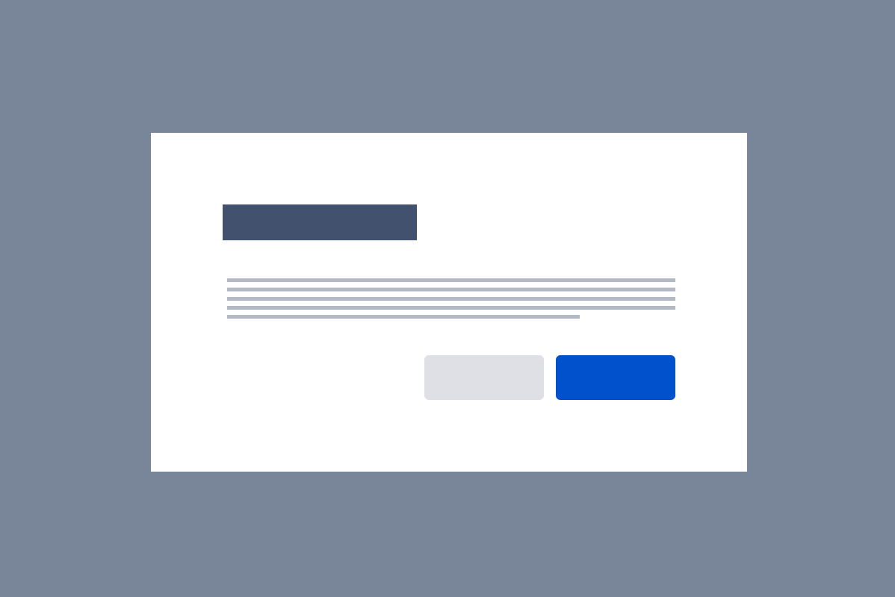

import buttonConciseDo from './images/button-concise-do.png';
import buttonConciseDont from './images/button-concise-dont.png';
import buttonCapitalizationDo from './images/button-capitalization-do.png';
import buttonCapitalizationDont from './images/button-capitalization-dont.png';
import buttonActionDo from './images/button-action-do.png';
import buttonActionDont from './images/button-action-dont.png';

## Usage

Buttons are triggers for events or actions. They’re commonly used as part of larger components or patterns such as [forms](/patterns/forms) or [modal dialogs](/components/modal-dialog).

Buttons:

- move users through a sequence of screens
- act as calls to action (CTAs)
- with an icon to convey meaning quicker
- with a badge indicate a value

## Anatomy

1. **Icon:** Use an icon to convey more meaning.
2. **Label:** Text that indicates the result of selecting the button.

## Behavior

Each button variation (`Button`, `LoadingButton` and `CustomThemeButton`) will render out a `<button>` element, an `<a>` element if a `href` prop is supplied, or render any other element type by using the component prop (for example, `component="span"`). Each button element looks and behaves similarly, regardless of element tag, as it is guided by the native `<button>` behavior. 

A `role` prop is inferred from the element type or you can pass in a role prop if you need to.

### Focus behavior

`tabIndex={0}` is added by default when the `component` prop is specified, so the button element can get browser focus regardless of the element type used.

On a `mousedown`, `event.preventDefault()` is always called to prevent the button from getting focus. This is questionable behavior that we hope to change in future.

When a native `<button>` is disabled, it loses browser focus and cannot be focused. We replicate this behavior by setting `tabIndex={-1}` on the button element and calling `element.blur()` when a button becomes disabled (`isDisabled` prop is set to true).

## Best practices

- Use a primary button to indicate the main action of a group button set.
- Subtle or secondary buttons should use a less dominant color.
- Button size matters - make sure the size of the button is large enough to interact with on web or other device but not too large so as to be visually overwhelming.
- Use action verbs or phrases to tell the user what will happen next.

## Do not put tooltips on disabled buttons

We do not support this this as it's not accessible. Disabled buttons are not reachable in the tab order and do not receive hover, focus or click events.

Do not attempt to create workarounds. If you are an Atlassian, Accessibility QA will make you redesign these implementations.

Some questions you should ask if you feel you need a tooltip on a disabled button:
- Is this information **essential** to the user experience? If so, don’t hide it behind a tooltip. Tooltips aren’t easy to discover and aren’t accessible on mobile. If it isn’t essential, consider whether you need to show it at all.
- Is this information **actionable**? Being shown things that you can’t use without any actionable next step can be frustrating or confusing. Consider only showing UI that a user is able to interact with, or replacing the disabled button with text that has the same content you were going to put in the tooltip. If you do this, you can make things even more actionable for the user by providing a link to a next step that they can take, or further information.

We know that disabled buttons with tooltips are often used to promote feature discovery. We are working on providing guidance on a core pattern for this use case in the future.

## Alignment

### Modal dialogs and focussed tasks

**Right align** buttons and place the primary button furthest right for a single focussed task or a [modal dialog](/components/modal-dialog). This is best for experiences with less copy, so users end scanning on the most important action (following a Z-pattern).

Also, right align buttons when a user is moving through a sequence of focussed screens (for example, going through an onboarding experience). The primary action should be furthest right.

### Single page forms and full-page experiences

**Left align** buttons for single-page forms and other full-page tasks where there is a lot of content in view, with the primary action furthest left. This aligns with how people scan full pages with more content (F-pattern), sorting by importance from left to right.

Flags, cards, and section messages also left-align the primary action, as they're typically part of a larger page experience.

### Exceptions

**Center align** buttons for [benefits modals](/patterns/benefits-modal), with the primary button on the right. Login forms may also have center aligned buttons (full-width).

## Content guidelines

Buttons labels should be concise and clear enough to indicate the next action to the user.

<DoDont
  type="do"
  image={{
    url: buttonConciseDo,
    alt: 'Atlaskit button that says Reset Password'
  }}
>
  Use concise, easy to scan, and clear button labels to indicate the next action to the user.
</DoDont>

<DoDont
  type="dont"
  image={{
    url: buttonConciseDont,
    alt: 'Atlaskit button that says Click here to choose a password'
  }}
>
  Use long, redundant button labels. Drop unnecessary articles, such as ‘a’ or ‘the’, for a more concise label.
</DoDont>

<DoDont
  type="do"
  image={{
    url: buttonCapitalizationDo,
    alt: 'Atlaskit button that says Copy ticket'
  }}
>
  Use sentence-case capitalization.
</DoDont>

<DoDont
  type="dont"
  image={{
    url: buttonCapitalizationDont,
    alt: 'Atlaskit buttons that say copy text in sentence case and all caps'
  }}
>
  Use title case captalization or all caps.
</DoDont>

<DoDont
  type="do"
  image={{
    url: buttonActionDo,
    alt: 'text that asks delete unpublished page? Followed by a delete CTA button and a cancel button'
  }}
>
  Use active verbs or phrases that clearly indicate action.
</DoDont>

<DoDont
  type="dont"
  image={{
    url: buttonActionDont,
    alt: 'text that asks delete unpublished page? Followed by a Yes CTA button and a No button'
  }}
>
  Use vague and generic labels that make the user read the dialog before taking action.
</DoDont>

## Disabled buttons

Use disabled buttons sparingly, and make sure to follow our [accessibility guidance](/components/button/usage#accessibility).

A disabled `<button>` is a native HTML concept, but disabled is not a native concept for other element types such as `<a>` and ``.

The behavior of a disabled `<button>` is imitated as much as possible regardless of element type.

A disabled `<button>` will not fire any user events. We imitate this by:

- Applying `pointer-events: none` to all children elements of the button element. This prevents inner elements publishing events.
- Calling `event.preventDefault()` and `event.stopPropagation()` in the [capture phase](https://javascript.info/bubbling-and-capturing) for the following events: `'mousedown'`,`'mouseup'`, `'keydown'`, `'keyup'`, `'touchstart'`, `'touchend'`, `'pointerdown'`, `'pointerup'`, and `'click`'. This prevents the event performing its default browser behavior and stops the event from proceeding to the bubble phase.
- Not calling provided bubble and capture event listeners.

For a disabled button we also set `tabIndex={-1}`, and if the element has focus, we call `element.blur()`.

## Buttons with an overlay

Buttons support an overlay element, which is used to display a spinner for `LoadingButton > isLoading`. When there is an overlay the normal button content fades out and the button is non-interactive but not disabled.

A `button` with an overlay:

- will block events as if it is disabled
- won’t lose focus automatically when the overlay is shown (unlike when it is disabled, where the focus is lost)
- allows focus to be given and removed from the element

The button will not show `:active` and `:hover` styles and otherwise keeps the same visual and cursor experience as if it did not have an overlay.

## Adding event listeners

For the most consistent behavior across elements, it’s safest to use bubble phase listeners on the button element and parent elements, for example, use `onClick` rather than `onClickCapture`. Although, event listeners *can* be added in either the capture or bubble phase on the button element. 

Bubble and capture event listeners will not be called when the button component is disabled.

For elements that are parents of a button you need to bind on the bubble phase (for example, `onClick`) since button does not abort the event until the capture phase. So as the event goes down the DOM tree in the capture phase, it’s not aborted until it reaches the button element. This means you will get a click event from a button on parents in the capture phase. A workaround is to add events to the window when disabled and stop the event a bit earlier, but that's a bit heavy.

## Accessibility

- Include alternative text using the aria-label prop when using icon buttons.
- When using an icon alongside text, do not add a label to the icon. Doing so will unnecessarily repeat labels for people using screen readers.
- Avoid using disabled buttons, especially in forms. Disabled buttons don't explain why the button isn't usable, and they aren't focussable at all for people using keyboard navigation. Instead, keep the button pressable, and use validation and errors to explain what needs to be done to proceed. Avoid puting [tooltips on disabled buttons](/components/button/usage#do-not-put-tooltips-on-disabled-buttons).

## Server

Consult [AUI](https://docs.atlassian.com/aui/latest/docs/buttons.html) for implementation details.

## Related

- [Forms](/patterns/forms)
- [Modal dialogs](/components/modal-dialog)
- [Dropdown menus](/components/dropdown-menu)
