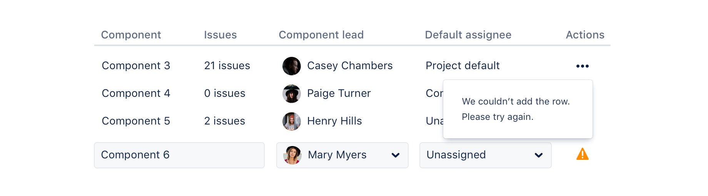

## Usage

Use dynamic tables when you need to display data in rows and columns, with additional features like
drag and drop and loading states that go beyond what’s available in native HTML tables.

Dynamic tables are best used if there is a large volume of information so that people can scan, sort
and analyse data.

Parts of a dynamic table:

1. **Header label**: Use this to indicate what type of information is in each column.
2. **Row**: Displays a relationship between separate table cells.
3. **Pagination**: If there's more than the maximum number of rows for one page, the pagination
   component appears at the end of the table, enabling people to navigate between pages.

## Accessibility

- Provide a visual `caption` for complex tables. This helps people gain context about the data. It
  also helps people with screen readers have an overview of the table.
- If you don’t use a `caption`, then you’ll need to use `label` to describe the table for assistive
  technologies. Avoid using both as they may conflict.
- Never rely on highlighted rows to convey important meaning, selection, or focus, as this isn’t
  accessible to people with visual disabilities.
- Never put additional controls like links or buttons in table headings.
- Never use tables to build visual layouts. Only use tables for structured data, and avoid headless
  tables.
- Clearly label columns with simple language. This makes it easier to understand and eases screen
  reader navigation.
- When offering edit options, make sure that the label for the button is unique to each row and
  references the row that’s being edited. For example, “Edit component 3" not “Edit".

## Best practices

### Editing row content

On simple tables where there's only a single type of content to display, an edit button is not
required.

For more complex tables where there are multiple types of editable content, add an edit link to the
more actions button. Use a modal dialog or dedicated page for entering content instead of input
fields that are directly part of the dynamic table.

### Removing a row

Use either a delete action in the "more actions" menu (if multiple actions are available) or a close
icon to allow people to delete a row. Once the row is deleted, both the content rows and input row
will shift upwards. Keyboard focus should move to the next focusable item.

### Error state

If an error occurs, highlight the affected row or text input with a supporting error icon, and help
people know how to proceed to resolve the error.

## Related

- For more empty state guidance, check out the
  [empty state component](/components/empty-state/examples).
- For pagination guidance, see the [pagination component](/components/pagination/examples).
- For guidance on showing contextual information, see the
  [modal dialog component](/components/modal-dialog/examples).
- For more on interactive table components, see the [select](/components/select/examples),
  [dropdown](/components/dropdown-menu/examples), and [avatar](/components/avatar/examples)
  components.
