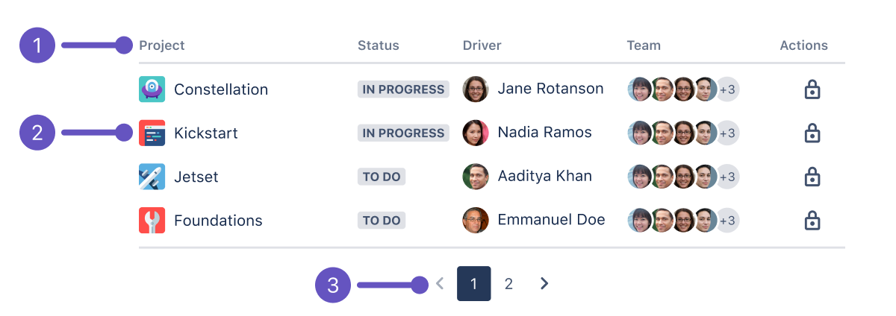

## Usage

Dynamic tables display data in rows and columns. They order information so that people can easily scan and analyse data.

## Anatomy

1. **Header label**: Indicates the type of information that is in each column.
2. **Row**: Displays a relationship between separate table cells.
3. **Pagination**: Indicates the amount of data presented in the table.

## Best practices

### Editing row content

On simple tables, where there's only a single type of content to display, an edit button is not required.
In more complex tables where there are multiple types of content displayed, you may want to add an edit link to the more actions button.
If your table is complex, with a large number of input fields,
you should consider using a modal dialog or dedicated page for entering content instead of a dynamic table.

### Removing a row

Use either a delete action in the "more" menu (if multiple user actions are available)
or an "x" icon to allow users to delete a row. Once the row is deleted, both the content rows and input row will shift upwards.

### Error state

If an error occurs, the affected row or text input should be highlighted with a supporting error icon.

## Content guidelines

- Use tables to make content easier to read.
- Use only relevant text or data so that it’s easy to understand.
- Clearly label columns with simple language. This makes it easier to understand and eases screen reader navigation.
- Provide a description for complex tables. This helps the user gain context about the data. It also helps people with screen readers have an overview of the table.

## Accessibility

This component has accessibility issues. This is something we are aware of and are working on. If this
is a direct blocker for usage of the component we'd recommend seeking alternative solutions in the interim.

## Related

- If you’re looking for more empty state guidance, check out our [Empty state component guidelines](/components/empty-state/examples).
- If you’re after more pagination guidance, see our [Pagination component guidelines](/components/pagination/examples).
- For more guidance about how to show contextual information, see [Modal dialog component guidelines](/components/modal-dialog/examples).
- For more information on interactive table components see [Select](/components/select/examples), [Dropdown](/components/dropdown-menu/examples), [Avatar](/components/avatar/examples) guidelines.
