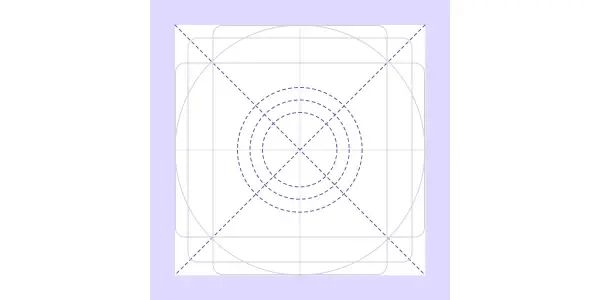
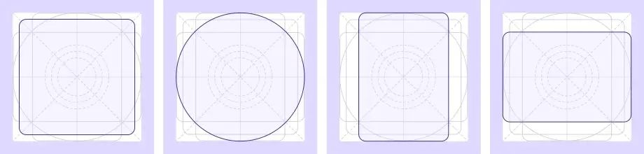

import iconVisualNoiseDont from './images/dos-donts/visual-noise-dont.png'
import iconVisualNoiseDo from './images/dos-donts/visual-noise-do.png'
import iconMeaningfulTextDont from './images/dos-donts/meaningful-text-dont.png'
import iconMeaningfulTextDo from './images/dos-donts/meaningful-text-do.png'
import iconCouplingDont from './images/dos-donts/coupling-dont.png'
import iconCouplingDo from './images/dos-donts/coupling-do.png'
import iconConceptDont from './images/dos-donts/concept-dont.png'
import iconConceptDo from './images/dos-donts/concept-do.png'

## Usage

Icons should be used intentionally to maximize comprehension and reduce cognitive load. Use it to call attention to a particular action, command, or section. If you’re questioning an icon’s use, it probably doesn’t need to be used.

To search through all the icons we have in our system, have a look at our [icon explorer](/components/icon/icon-explorer).

## Anatomy

1. **Canvas area:** The full boundary of an exported icon – includes **grid area** and **icon**.
2. **Icon**.
3. **Grid area:** The boundaries that an icon can be placed within.

## Behaviour

### Icon grid

Regular icons are designed on a 20px grid and exported on a 24px canvas.

### Shapes

Icons on the grid use basic foundational shapes. These include circle, square and rectangles (horizontal and vertical). Sticking to these shapes in the grid keeps consistent proportions throughout the icon set.

### Style

#### Filled v.s. outlined

Use outlined icons unless the required context necessitates a filled icon.

An example of a necessary filled icon is a watch icon. A filled watch icon demonstrates the page is being watched. The outlined icon indicates that the page is not watched. If necessary, a filled icon could be used to indicate that something is "on", while an outlined icon could indicate that something is "off". Avoid this behaviour altogether when icons are contained within the navigation panel.

### Color

Our icons are available to use as a single color. Dark neutrals help with contrast while maintaining its prominence as a supportive element.

For components containing confirmations, alerts, information, and acknowledgments, follow the guidelines associated with the component and use-case.

Using icons with a text label and high-contrast color will enhance the usability and [accessibility](/foundations/accessibility) to all users.

## Best practices

Use an icon that currently exists in our iconography set whenever possible.

### Support icons with text

Use icons in combination with meaningful text to support people progressing through the product in [an accessible manner](/foundations/accessibility). Most icons are not widely recognized, so whenever possible, use a label or supporting text to ensure its meaning is understood.

To help increase usability, our icon color has at least an [AA standard color contrast ratio](http://www.w3.org/TR/WCAG/).

<DoDont
  type="do"
  image={{
    url: iconMeaningfulTextDo,
    alt: 'Atlaskit button with a tick icon and label which says Approve'
  }}
>
  Use icons with meaningful text labels.
</DoDont>

<DoDont
  type="dont"
  image={{
    url: iconMeaningfulTextDont,
    alt: 'Atlaskit button with a tick icon'
  }}
>
  Icons without labels can be unclear.
</DoDont>

#### Coupling icons and text

The icon you choose should be clearly coupled to the text label to prevent confusion about what step people need to take.

<DoDont
  type="do"
  image={{
    url: iconCouplingDo,
    alt: 'Comment icon with text next to it which says Comment'
  }}
>
  Use an icon that is closely coupled to your text label.
</DoDont>

<DoDont
  type="dont"
  image={{
    url: iconCouplingDo,
    alt: 'Comment icon with text next to it which says Mute'
  }}
>
  Use an icon that is too far removed, unrelated, or the opposite of the text label.
</DoDont>

### Icons are more than decorations

Avoid using icons solely for decoration or visual interest as it detracts from their intention elsewhere. Consider the surrounding context of icons too; if icons are cluttered and aren’t spaced out, it can lead to more visual noise and confusion.

<DoDont
  type="do"
  image={{
    url: iconVisualNoiseDo,
    alt: `Dropdown menu with text 'Release' as its label. Cog icon next to the dropdown menu. The dropdown menu is expanded to show three options: Create board, Hide menus, Schedule dates.`
  }}
>
  Use a single icon for clarity.
</DoDont>

<DoDont
  type="dont"
  image={{
    url: iconVisualNoiseDont,
    alt: `Dropdown menu with text 'Release' as its label. Cog icon next to the dropdown menu. The dropdown menu is expanded to show three options: 'Create board' with a Create icon to the left, 'Hide menus' with an Eye icon to the left, 'Schedule dates' with a Calendard icon to the left.`
  }}
>
  Too many icons in UI create visual noise.
</DoDont>

### Icons can convey a specific meaning

Icons can represent a single concept or be thematic in nature. For example, + almost always represents add, while ☆ might represent favorite, like, or star. Using an icon appropriately allows people to create a connection to a concept, so don’t over-extend what an icon represents.

<DoDont
  type="do"
  image={{
    url: iconConceptDo,
    alt: `Plus icon with text 'Create' next to it.`
  }}
>
  Use a single icon per concept.
</DoDont>

<DoDont
  type="dont"
  image={{
    url: iconConceptDont,
    alt: `Create User icon with text 'Create user' to the right. Create Item icon with text 'Create item' to the right. Calendar Create icon with text 'Create meeting' to the right.`
  }}
>
  Multiple icon variations should not be used for the same concept.
</DoDont>

## Content guidelines

- Use actionable language examples, punctuation rules and reusable content recommendations for consistency.
- Use do's and don’ts to support guidelines

## Accessibility guidelines

- Use icons in combination with meaningful UI text to ensure comprehension and accessibility.
- For icons with no accompanying UI text, also include an aria-label for the icon. There are very few widely recognized icons, so try to avoid this when possible.
- Learn more about meaningful text labels in [accessibility guidelines](/foundations/accessibility).
- Icons must have an tooltip attached unless it has text that communicates what the icon is conveying. Use [tooltips](/guidelines/product/components/tooltips) to let the user know what happens when the tab is selected. When writing tooltips, be short and concise and follow the ADG [writing guidelines](/guidelines/product/foundations/writing-style).

## Server

[AUI icons](https://docs.atlassian.com/aui/latest/docs/icons.html) use different sizing and certain icons may not be available.

## Related

We also have object icons which are grouped and color-coded by use case, and are derived from this iconography foundation. See [object icon guidelines](/components/icon/icon-object).

If you’re looking to show other messages, see [inline message guidelines](/components/inline-message/examples).
