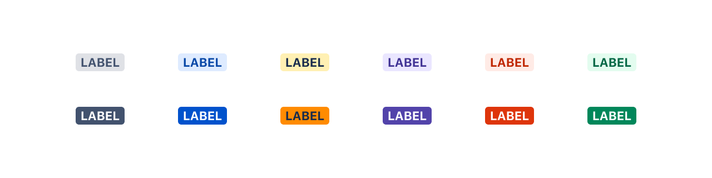

## Usage
Lozenges are either subtle or bold. 

#### Use:
- subtle lozenges by default and where it’s likely that more than a couple of lozenges will appear on the screen
- bold lozenges sparingly 

The [color system](https://atlassian.design/guidelines/product/foundations/color) can help keep a consistent visual language that helps users learn to quickly recognize the meaning of a status across products. Combine this with a logical label. 

## Anatomy

## Accessibility
Make sure all lozenge labels have alternative text for screen readers.

Lozenge text must be clear enough for color blind users to be able to understand immediately without needing to rely only on the [color](https://atlassian.design/guidelines/product/foundations/color).

## Related
- For tallies or counts use a [badge](https://atlassian.design/guidelines/product/components/badges).
- To visually label UI objects use a [tag](https://atlassian.design/guidelines/product/components/tags).