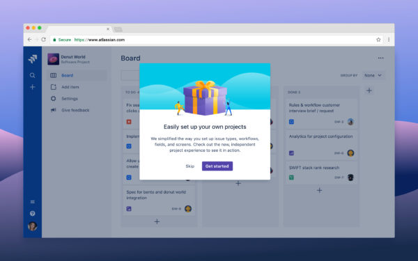
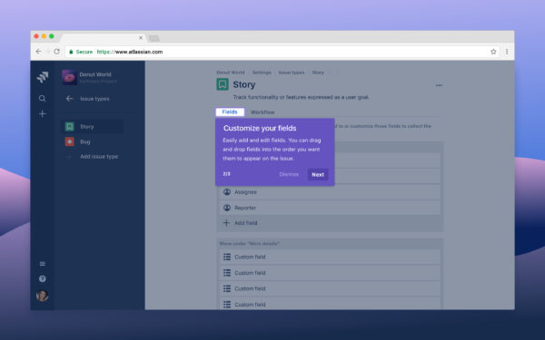
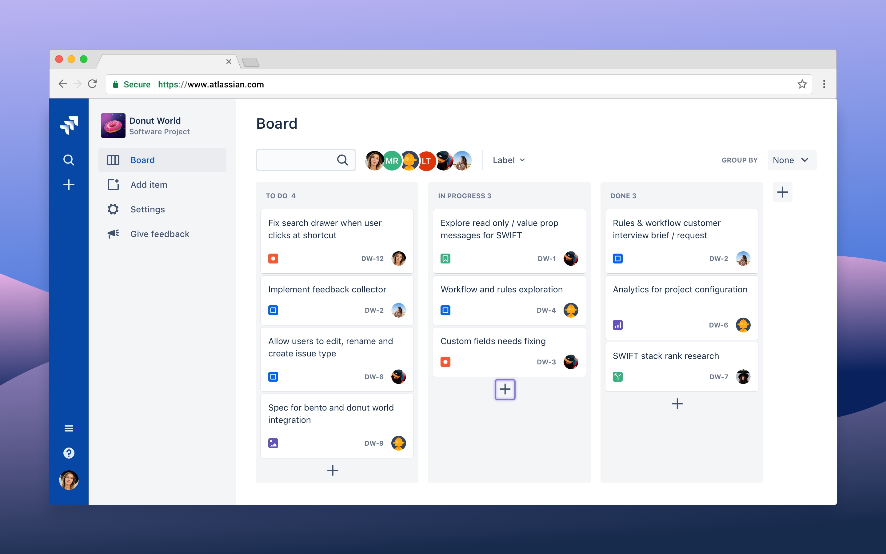
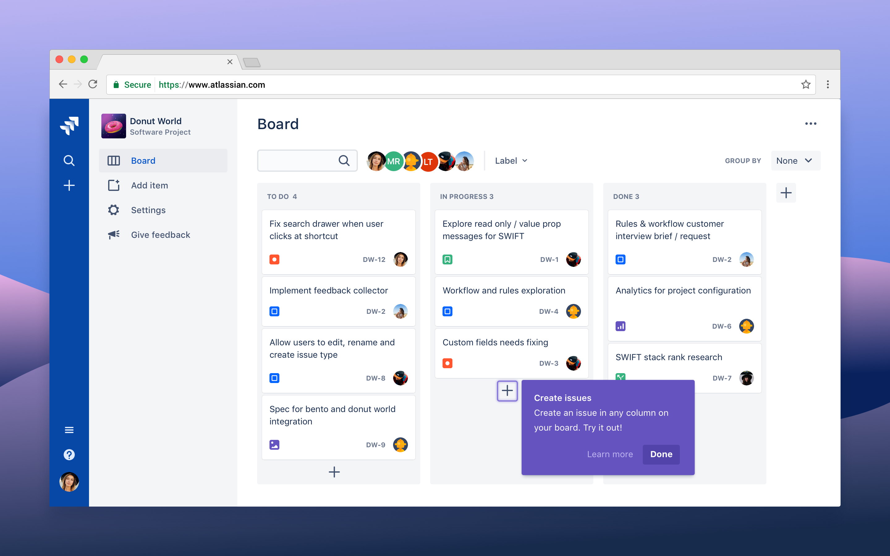
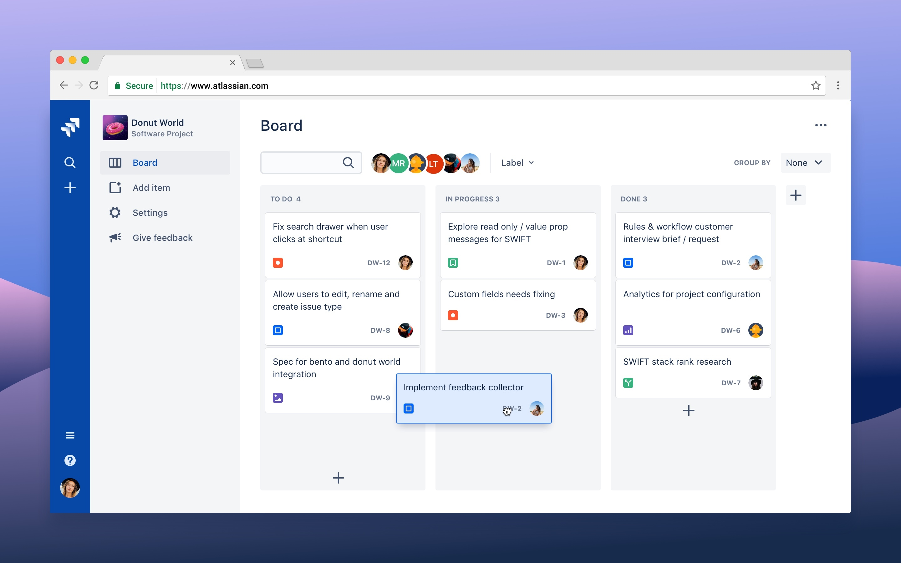
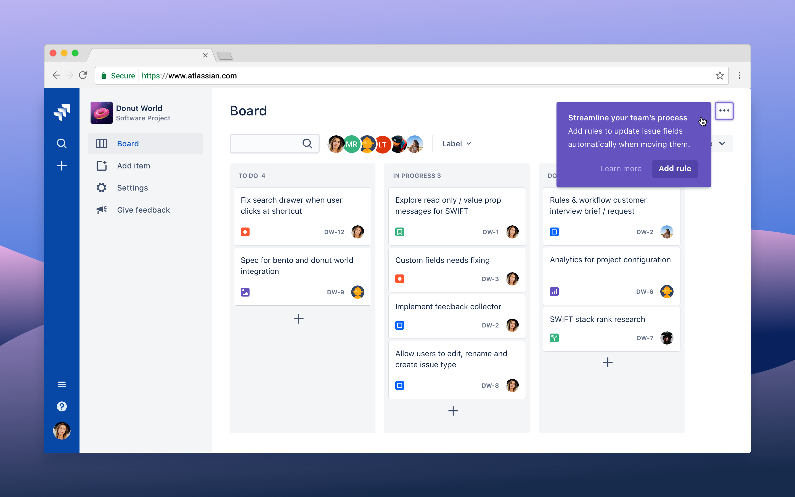

import SectionMessage from '@atlaskit/section-message';

## Usage

An onboarding spotlight focuses attention on a specific part of the UI, like a button or an icon.
Spotlights can also guide people through tasks that require multiple steps to complete.

1. **Spotlight target:** The section of the UI that you want to call attention to. It can be
   rectangular or circular. Typically this surrounds an isolated element like an icon, button, or
   text field.
1. **Message:** Try to restrict messages to two lines in length. Showcase a single change and how it
   benefits the person reading your message. Try to avoid just naming the function.
1. **Action:** In a multi-step tour, these will be the skip and next buttons. In spotlights where
   you want people to try an action, the button should lead to that new action.
1. **Pulse:** A pulse animation to draw attention to the spotlight target.
1. **Blanket:** A translucent overlay that covers the rest of the screen that is not being spotlit.
<!-- This is only necessary for multi-step spotlight tours. -->

## Behavior

### Pulse

The spotlight target can have a pulse animation to draw attention to the focused area. As they can
be very distracting and increase cognitive load, limit the number of pulses per spotlight.

## Best practices

- Only show one spotlight at a time.
- For spotlight tours, keep the entire flow in mind. Sequence tasks and messages in a logical way to
  increase success.
- Offer a dismiss option at every step. Don't force people to participate.
- Ideally, spotlights should only have a single step. Don't overwhelm people with too much
  information. Try and combine or eliminate tasks where possible. Aim for 3-4 steps maximum. People
  only need enough information to get them started.
- Make sure your spotlight isn’t competing with other onboarding messages from other teams. Not
  every change requires changeboarding, so ask yourself if this message is really necessary or
  helpful.

## Accessibility

- When there's a heading, its value is referenced as the accessible name of the spotlight dialog. If
  you need to add/reference another accessible name, consider either
  [label](/components/onboarding/code#Spotlight-label) or
  [titleId](/components/onboarding/code#Spotlight-titleId) prop. Avoid using both of these props at
  the same time.
- The pulse animation can be very disruptive for some users. Like with the spotlight itself, limit
  the pulse animation to one spotlight at a time and limit the number of pulses.
- If the spotlight opens upon page entry, avoid a pulse animation as the attention is already on the
  spotlight.

## Content guidelines

### Headings

- Use the heading to communicate the main benefit to the user. For example, "Manage your work"
  instead of "Work items".
- Write headings in sentence case.
- Limit headings to just a few words. Personalize where you can, for example, “Your room”.

### Message copy

- Include the benefits of the feature and why it's important to the person seeing it.
- Keep the text length to two lines at the app's minimum supported size.
- Be considerate of people's time and patience. Short amounts of information are better. Don't
  repeat content from the title, and put the most important keywords at the start of the sentence.
- If you talk about an element or a location within the body of the spotlight message, that element
  should be visible on the screen at the same time. Don't talk about things that the viewer can't
  see.
- Avoid having people look in another location for more information, but if it can't be avoided, use
  a link to support documentation.

### Call to action (CTA)

- For buttons leading people through the steppers of a spotlight, use "Next".
- Add an option to dismiss or cancel reassures people that they can opt out.
- For the last in a series of steps, or for any action which confirms or closes a spotlight message,
  use "OK".
- Spotlight components clone HTML elements they encompass. However, if there are internal components
  such as HTMLCanvasElement, these will not be cloned automatically. You'll need to find the canvas
  element in the DOM and clone it manually.

## First impressions

First impressions are the experiences that people using our apps encounter when they do or see
something for the first time.

All teams can use the first impression guidelines to drive people towards their "aha!" moment — when
they know how something delivers value to them.

### Principles for good first impressions

Great first impressions can influence a person's decision to engage with, keep using, and recommend
our apps. They should make people feel supported, motivated, confident, and empowered.

| **Principle**               | **How to achieve it**                                                                                                                                                                                                                                                                                                                                                                                                 |
| --------------------------- | --------------------------------------------------------------------------------------------------------------------------------------------------------------------------------------------------------------------------------------------------------------------------------------------------------------------------------------------------------------------------------------------------------------------- |
| **Driven by user benefits** | Know your target audience and demonstrate the value proposition to them when they need it. Understand the user's goals, what they want to accomplish, and how the feature or change will benefit them.                                                                                                                                                                                                                |
| **Thoughtful**              | Think about what people were doing before encountering your first impression pattern and what they'll be doing next. First impression patterns should be dismissible, so we get out of people's way.                                                                                                                                                                                                                  |
| **Continuously considered** | Onboarding and change management should be built into the design and development cycles. It should not be an afterthought.                                                                                                                                                                                                                                                                                            |
| **Holistic**                | Consider the whole user journey when creating a first impression. Define the priority and quantity of all push notifications the user will encounter based on their needs. All first impressions should complement rather than compete with each other. Know what other first impressions or notifications your user might encounter, so you can prioritize the right one at the right time and minimize distraction. |

## First impression patterns for existing users

There are two first impression patterns for current users:

- [New experience](#new-experience-pattern) — to introduce existing users to an entire set of
  feature changes, which can include new functionality, look, or interaction points.
- [New or updated feature](#new-or-updated-feature-pattern) — to introduce existing users to a new
  or updated feature.

<SectionMessage
	title="Don't use these patterns for new users signing up for an app"
	appearance="warning"
>
	

		We don't want to overwhelm people with content about experiences they haven't seen before, such
		as change management messaging.
	

</SectionMessage>

Choose the pattern based on the size of impact the change may have on the person’s experience or the
usability of the app.

| **Size of change** | **Description**                                                                                                                                                                                                                                                                             | **Pattern for change**                       |
| ------------------ | ------------------------------------------------------------------------------------------------------------------------------------------------------------------------------------------------------------------------------------------------------------------------------------------- | -------------------------------------------- |
| **Small**          | A change that impacts a small part of our apps or only a subset of users.                                                                                                                                                                                                                   | New or updated feature                       |
| **Medium**         | A change that significantly impacts how all or a majority of users interact with a part of our apps. If the user needs to navigate to other parts of the app, consider the new experience pattern.                                                                                          | New or updated feature **or** new experience |
| **Large**          | A change that dramatically impacts how all users interact with and use our apps. Large changes should be rolled out on a well-planned schedule, ideally with an opt-in and opt-out strategy. Ensure the customer impact is clearly understood and communicated before any change rolls out. | New experience                               |

These patterns should be contextual and focused on the benefit to the person, ideally validated
through testing with people.

Make sure people are prepared for the change with an opt-in to opt-out strategy before forcing
everyone into the new experience.

Existing admins, power users, end users, and novice users may have different reasons to be excited
about your new feature:

- Admins — focus on configuration and control.
- Power users — focus on shortcuts and improving the way they work.
- End users and novice users — focus on the benefits for their teams and how it empowers them.

### New experience pattern

This pattern introduces existing users to an entire set of feature changes, for example, new
functionality, appearance, or interaction points.

Use this pattern to help people understand the value of the new feature set, and how it benefits
them and their team. Focus on the top two to three benefits for the user and show these in context.

#### Entry points

Choose an appropriate place to notify people of the new experience, but don't take over their work:
entry points for new experiences should be dismissible.

Only highlight the feature and its top benefit in one place.

If the onboarding (spotlight) component isn’t suitable, you could also use
[benefits modal](/components/onboarding/benefits-modal/examples).

If you can't decide on the best entry point for your new experience, run an early signal test with
existing users.

In this example, an admin gets a notification about a new feature set. They can either try out the
experience or dismiss the notification.

#### Educational content

Use the spotlight component to highlight the top two to three benefits of the new experience in
context.

If your app supports in-app help, point out where people can find more information when they dismiss
the educational content.

In the example, the admin chooses to try out the new feature set and is shown in context where it
lives in the app. They are shown two to three dismissible spotlights that showcase the top benefits.

### New or updated feature pattern

This pattern introduces existing users to a new or updated feature.

Use this pattern to help people understand the value of the feature, preferably in the context of a
task. Focus on the top benefit and show them how to achieve it.

#### Entry point

Choose an appropriate place to notify people of the new feature, but don't take over their work.
Entry points for new feature announcements should be passive and temporary (they shouldn't live
forever).

Allow power users to uncover advanced features progressively rather than announcing changes they may
not be interested in.

Use the spotlight pulse to subtly highlight where your new feature is accessed.

In the example below, the user navigates to their project and a spotlight highlights where the
feature lives.

#### Educational content

Use the spotlight component to highlight the top benefit of the new feature in context.

When people click the spotlight pulse, they see a short message summarizing the new feature. They
are encouraged to try the new feature or learn more about it.

#### Inflection point example

For features that provide shortcuts for power users or otherwise improve the way they work, consider
introducing a spotlight after recognizing a pattern of repeated behavior. We call these "inflection
points".

In this example, an admin moves a card from **to do** to **in progress**. The admin then opens the
card and assigns it to someone else.

The admin repeats this action two more times. At this point, we can recognize that the admin is
repeating the action multiple times and suggest, using a spotlight, a way to automate this task.

## Related

- For a more flexible, standalone spotlight message, see
  [spotlight card](/components/onboarding/spotlight-card/usage).
- For an onboarding modal, see [custom modal dialog](/components/modal-dialog/examples).
