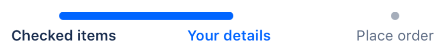

## Usage

Use a progress tracker to guide users through steps or actions across multiple screens, in order to complete a task. Progress tracker tasks must have three or more steps. The tracker shows users where they are in the process, and can be used to navigate through the process by selecting steps.

- Use a progress tracker to guide users through steps or actions across multiple screens, in order to complete a task.
- Progress tracker tasks must have three or more steps.
- The tracker shows users where they are in the process, and can be used to navigate through the process by selecting steps.

## Anatomy

1. **Progress bar:** Shows users their progress and the number of steps required to complete the task.
2. **Current step:** Shows the current step that the user is on.
3. **Unvisited:** Shows steps that user has not visited. The step and label are more subtle to indicate this.
4. **Visited:** Steps that have already been visited have clickable links, so that users can navigate back to them.
5. **Disabled:** A grayed-out label indicates a step that users can not revisit.

## Best practices

- Use labels that clearly indicate the purpose of the step. When writing, keep options to a single line of text, be short and concise (1-2 words), and follow the [writing guidelines](/content/writing-style)
- If a task needs more than six steps, consider simplifying the process or breaking it up into multiple tasks
- If there are less than three steps, consider using a button labelled "Next"

## Content guidelines

When labeling each step, identify the general theme of each step so that if details in the process change, the label still makes sense to the user.

For example, you have a check-out process where, depending on whether the purchase is of a digital item or a physical item, users may or may not need to enter their shipping details, but must always enter payment details. Calling this step "Your details” allows it to either be connected to the payment and shipping details screen, or just the payment screen.

## Server

Consult [AUI](https://docs.atlassian.com/aui/latest/docs/progress-tracker.html) for implementation details.

## Related

- Use a [progress indicator](/components/progress-indicator) to show the user where they are in a journey.
