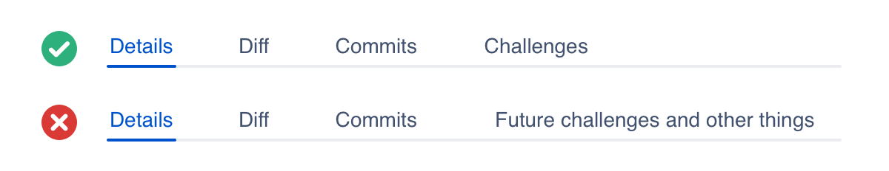

## Usage

Tabs allow users to switch between different sets of content on the same page. Each tab's content is independently categorized and mutually exclusive of the content of other tabs.

## Anatomy

1. **Selected:** The active tab.
2. **Unselected:** The other available tabs.
3. **Divider:** Separates the tab navigation and content.

## Content guidelines

Tab labels provide clear and concise explanations of the content within.

## Server

Consult [AUI](https://docs.atlassian.com/aui/) for implementation details.

## Related

Use [tooltips](/components/tooltips) to let the user know what happens when the tab is selected. When writing tooltips, be short and concise and follow the [writing guidelines](/content/writing-style).

