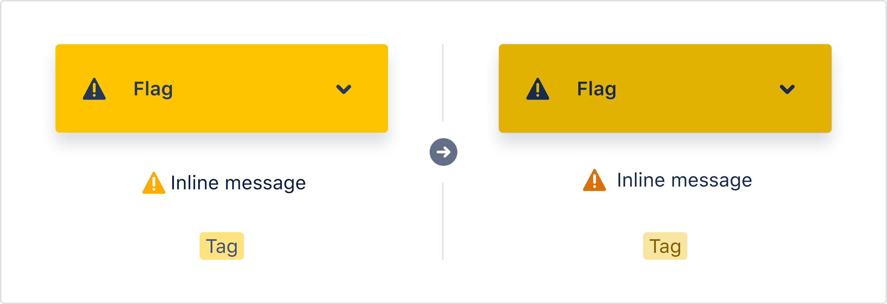
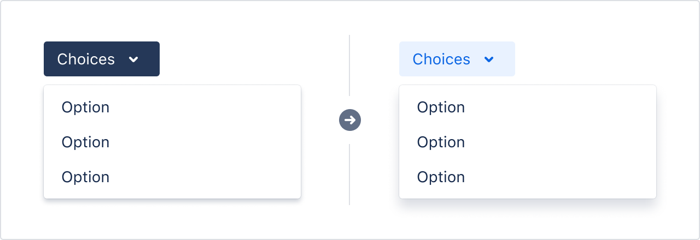
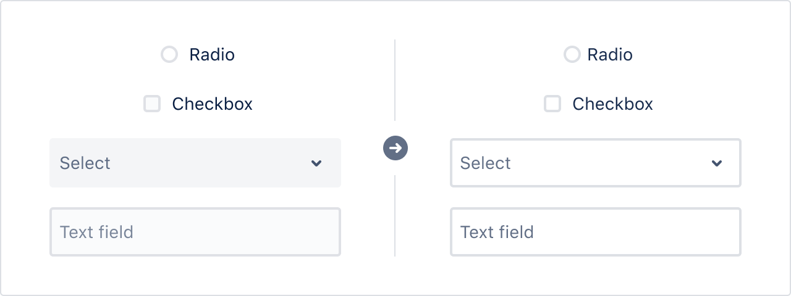
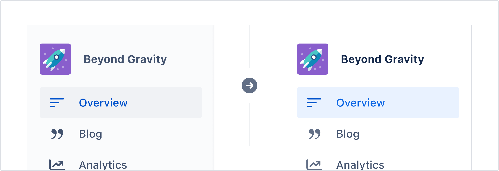
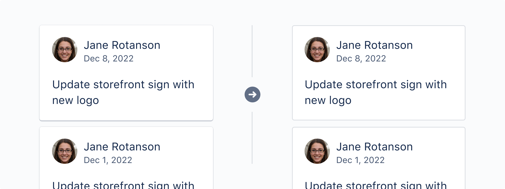

import SectionMessage, {
  SectionMessageAction,
} from '@atlaskit/section-message';

We are moving towards a new way of accessing color and elevations: through design tokens.
This guide is for those just starting to migrate to the new design tokens solution, highlighting the new changes.

<SectionMessage
  title="This is a preview of our new color and theming system, powered by design tokens"
  appearance="warning"
>
  <p>
    Expect frequent changes as we iterate over the coming months.
    For early access and release updates, <a href="https://community.developer.atlassian.com/t/introducing-design-tokens-new-colour-foundations-and-dark-mode/62258">see our developer community announcement</a>.
    For Atlassian employees, <a href="https://go.atlassian.com/tokens">see details</a>.
  </p>
</SectionMessage>

## Before you begin

Make sure you understand the basics of design tokens. Learn about this in [design tokens](/foundations/design-tokens/).

## Colors are changing

Tokens and theming are being launched alongside our new color system. Our new color system brings usability, accessibility, consistency, and visual improvements.


In the new system, the new colors are named differently. Instead of using a letter followed by numbers (such as, `N0`, `B100`, `G200`), the new system uses the full color name followed by numbers (such as `Neutral0`, `Blue100`, `Green200`).


The colors are also not completely equivalent. For instance, `N100` is not the same as `Neutral100`. You may notice colors changing in light mode as you adopt design tokens.

[Learn more about our new colors](/foundations/color-new).

### Accessible yellows

For example, yellows are darker to provide options that follow WCAG AA guidelines for text, icons, borders, and backgrounds ([WCAG 1.4.11](https://www.w3.org/WAI/WCAG21/Understanding/non-text-contrast.html),
 [WCAG 1.4.3](https://www.w3.org/WAI/WCAG21/Understanding/contrast-minimum.html)).



### Selected states reinforce our brand colors

Selected state colors in light mode use a blue color scheme instead of the dark gray from before so that it's less visually dominating.



## More consistent text colors

There are now three options for neutral text:

- `color.text`: Use for primary text, such as headings, subheadings, body text, and on colored backgrounds.
- `color.text.subtle`: Use for secondary text, such as navigation, input field labels, and all caps subheadings.
- `color.text.subtlest`: Use for tertiary text, such as meta-data, breadcrumbs, input field placeholder, and helper text.


## More consistent form fields

Form inputs, such as text field, text area, radio, checkbox, select, and dropdown menu, are now more consistent in appearance.
We have dedicated tokens to use on form inputs: `color.border.input` and `color.background.input`.



## Elevations are changing

Our elevation system has also been updated to be more consistent when using tokens. There are now five elevation levels which differ slightly across light and dark mode.

[Learn more about our new elevations](/foundations/elevation/).


Even though the surface colors looks the same for some elevations in light mode, they will look different in dark mode. It's important to pair raised, overlay, and overflow surface colors with shadows for this reason.
Refer to our [elevation guidelines](/foundations/elevation/) for token pairing guidance.


### Less unneccessary elevations

Not everything that uses an elevation with a shadow today should continue doing so. 
Rather than adding more visual complexity with elevations, consider using a simple border or background to group content. Elevations should be reserved for things that are draggable or lay on top of other surfaces.



Navigation components will no longer use an elevation with a shadow. Instead, use the flat, default elevation with a default border to separate it.




## Changes for designers

We are working on new Atlassian Design System Figma libraries, which will include updated colors, design tokens, and themed components.
There will also be a new Atlassian Design Tokens plugin, which will help you migrate to (and use) design tokens in your Figma files. The current libraries will eventually be deprecated.

## Changes for engineers

Token migration involves replacing all existing color uses in your code. 

During this rollout period, tokens are only being used internally. Until tokens are enabled for the whole product via feature flag, 
use fallbacks as shown in the following code samples. The value of the fallback should be the original color used before converting 
your experience to tokens.

Atlassians employees can install the [Chrome extension](https://chrome.google.com/webstore/detail/tokens-test-theming-exten/aediombkjpcbdgppnoidkhkmomngghhc/) and 
[storybook add-on](https://www.npmjs.com/package/@atlaskit/storybook-addon-design-system) to preview tokens ahead of time.

#### Example of converting colors to use tokens

In the following sample, the `B400` will be the fallback that we provide.
Conversion in code looks like this:

```diff
+import { token } from '@atlaskit/tokens';
import { B400 } from ‘@atlaskit/theme/colors;

-color: B400
+color: token('color.background.selected.bold, B400)
```

#### Example of converting an elevation to use tokens
```diff
import { elevation } from '@atlaskit/theme';
+import { N40A, N50A } from '@atlaskit/theme/colors';
+import { token } from '@atlaskit/tokens';

-${elevation.e100}
+box-shadow: ${token(
+  'elevation.shadow.raised',
+  `0 1px 1px ${N50A}, 0 0 1px 1px ${N40A}`,
+)};
```

Using tokens will be supported by [linting rules](https://www.npmjs.com/package/eslint-plugin-design-system), allowing us 
to have a global theme switch between dark and light modes.
If you’re interested in what will be shipping in this project, 
please read the [technical considerations](https://hello.atlassian.net/wiki/spaces/DST/pages/1167209534/Technical+considerations) (Atlassian employees).

### Codemod (CSS-in-JS)

We've also provided a [codemod](https://developer.atlassian.com/cloud/framework/atlassian-frontend/codemods/intro-to-codemods/) to help the migration by converting the color to a suggested token. 
When you run the codemod, it goes into every single color in the target files and suggests tokens based on context of the surrounding code.

This is what it looks like after running the codemod.

```diff
export const DangerMessage = style.div`
-  background-color: ${colors.R50};
+  background-color: ${token('color.background.danger', colors.R50)};

  :hover {
-    background-color: ${colors.R60};
+    background-color: ${token('color.background.danger.hovered', colors.R60)};
  }
  
  :active {
-    background-color: ${colors.R80};
+    background-color: ${token('color.background.danger.pressed', colors.R80)};
  }
`
```

Use `@atlaskit/codemod-cli` to run the codemod cli

```
npx @atlaskit/codemod-cli --parser tsx --extensions ts,tsx,js <relative-path>
```

The CLI will show a list of components and versions, select `@atlaskit/codemod-cli: theme-to-design-tokens` and your code will be automatically be migrated. However, the codemod only provides token suggestions which means manually review is still required after running the codemod.

### Codemod (CSS, SASS, Less)

We have also provided a “vanilla” css codemod for users of css,sass and less. 

Use `@atlaskit/codemod-cli` to run the codemod cli

```
npx @atlaskit/codemod-cli --extensions css,scss,less <relative-path>
```

The CLI will show a list of components and versions, select `@atlaskit/codemod-cli: css-to-design-tokens` and your code will be automatically be migrated. 
However, the codemod only provides token suggestions which means manually review is still required after running the codemod.

### Chrome browser extension (Atlassian employees)
To install the Chrome browser extension:
1. Visit [Tokens Test Theming Extension](https://chrome.google.com/webstore/detail/tokens-test-theming-exten/aediombkjpcbdgppnoidkhkmomngghhc/) and install the Chrome extension.
2. Open a new tab and navigate to an Atlassian product.
3. Open Developer Tools.
4. Navigate to the Theming extension.
5. Voila! You're ready to toggle between Light and Dark themes and check the amazing progress and work the teams have done.

You can also pin it to your main toolbar for easy access, from the Extension popup.

## Get help

Go to [#design-system-tokens-early-adopters Slack channel](https://atlassian.slack.com/archives/C0256AVSPHN) for questions or issues about design tokens and relevant tooling (Atlassian employees). 
Go to [#help-design-system Slack channel](https://atlassian.slack.com/archives/CFJ9DU39U) for all other questions related to the Atlassian Design System (Atlassian employees).

## Related

- Get design token usage guidelines for [color](/foundations/color-new) and [elevations](/foundations/elevation).
- See the list of [all design tokens](/components/tokens/all-tokens) for full descriptions and values for all tokens.