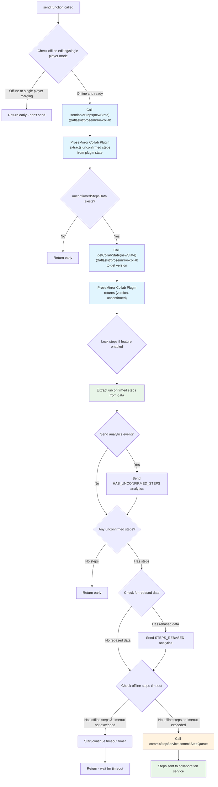
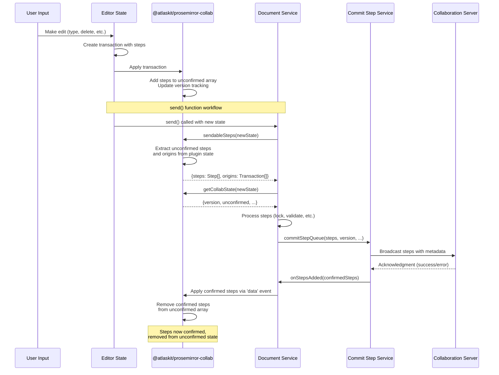
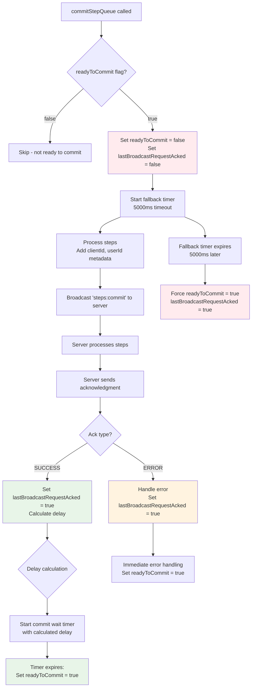
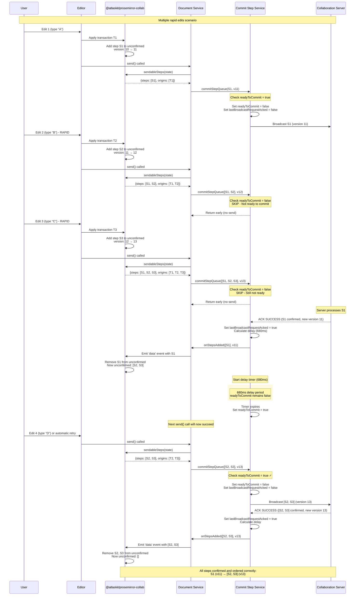

# Document Service Send Function Analysis

## Overview

The `send` function in `src/document/document-service.ts` is a critical component of the
collaborative editing system that handles the transmission of document changes (steps) from the
local editor to other participants. This document provides a deep dive into how the function works,
with particular focus on how unconfirmed steps are stored and retrieved, and how the commit queue
manages step transmission.

## Main Workflow

The `send` function orchestrates the process of sending ProseMirror steps to the collaboration
service. Here's the detailed workflow showing the integration with `@atlaskit/prosemirror-collab`:



## @atlaskit/prosemirror-collab Integration

The `@atlaskit/prosemirror-collab` package is the core component that manages collaborative editing
state within ProseMirror. It provides the fundamental infrastructure for tracking unconfirmed steps
and handling collaborative operations.

### Key Functions from @atlaskit/prosemirror-collab

#### 1. `sendableSteps(state: EditorState)`

- **Purpose**: Extracts steps that are ready to be sent to the collaboration server
- **Returns**: `{ steps: Step[], origins: Transaction[] } | null`
- **Usage**: Primary method used by the send function to get unconfirmed steps
- **Internal Logic**: Accesses the collab plugin state and returns pending steps with their original
  transactions

#### 2. `getCollabState(state: EditorState)`

- **Purpose**: Direct access to the collaboration plugin's internal state
- **Returns**: `{ version: number, unconfirmed: Step[], ... } | null`
- **Usage**: Used to get version information and direct access to unconfirmed steps
- **Internal State**: Contains version tracking, unconfirmed steps array, and other collaboration
  metadata

#### 3. Plugin State Management

The collab plugin maintains its state within the ProseMirror editor state:

```typescript
// Plugin state structure (conceptual)
{
  version: number,           // Current document version
  unconfirmed: Step[],      // Steps not yet acknowledged by server
  origins: Transaction[],   // Original transactions for each step
  // ... other internal state
}
```

### Integration Points with Document Service

The Document Service relies heavily on `@atlaskit/prosemirror-collab` for all collaboration-related
operations:

#### 1. **Step Extraction** (Primary Integration)

```typescript
// In send() function
const unconfirmedStepsData = sendableSteps(newState);
if (!unconfirmedStepsData) return;

const { steps, origins } = unconfirmedStepsData;
```

#### 2. **Version Management**

```typescript
// Getting current version for synchronization
private getVersionFromCollabState(state: EditorState, resource: string) {
    const collabState = getCollabState(state);
    return collabState?.version || 0;
}
```

#### 3. **Conflict Detection** (Reconnection Scenarios)

```typescript
// Checking for unconfirmed steps during reconnection
const unconfirmedSteps = state ? getCollabState(state)?.unconfirmed : undefined;
if (steps.length > 0 && unconfirmedSteps && unconfirmedSteps.length > 0) {
	// Handle potential conflicts
}
```

#### 4. **Step Acknowledgment Flow**

When steps are successfully sent and acknowledged:

- Document Service receives confirmation via `onStepsAdded()`
- Emits 'data' event to ProseMirror via `providerEmitCallback`
- `@atlaskit/prosemirror-collab` processes the event and removes confirmed steps from unconfirmed
  array

#### 5. **Error Recovery Integration**

- **Catchup Operations**: When version conflicts occur, the collab plugin state is updated with new
  document versions
- **Step Rebasing**: The plugin handles automatic rebasing of unconfirmed steps against incoming
  remote steps
- **State Restoration**: During document recovery, the plugin state is reset while preserving
  unconfirmed steps for reconciliation

## Unconfirmed Steps Storage and Retrieval

### How Unconfirmed Steps are Stored

Unconfirmed steps are stored within the ProseMirror editor state using the
`@atlaskit/prosemirror-collab` plugin. The storage mechanism works as follows:

1. **Plugin State Integration**: Unconfirmed steps are stored as part of the ProseMirror collab
   plugin state, which is embedded within the main editor state as a plugin-specific state slice.

2. **Step Origins Tracking**: Each step maintains a reference to its original transaction
   (`origins`) to track the source of changes even after rebasing operations.

3. **Automatic Management**: The collab plugin automatically manages the unconfirmed steps array:
   - **Adding Steps**: When transactions are applied locally, new steps are added to the unconfirmed
     array
   - **Removing Steps**: When acknowledgments are received from the server, corresponding steps are
     removed
   - **Rebasing**: When remote steps are received, local unconfirmed steps are rebased against them

4. **Version Synchronization**: The plugin tracks the document version to ensure proper ordering and
   conflict resolution.

### How Unconfirmed Steps are Retrieved

The retrieval process involves several key functions:

#### 1. `sendableSteps(state)` - Primary Retrieval Function

```typescript
const unconfirmedStepsData = sendableSteps(newState);
```

- **Source**: `@atlaskit/prosemirror-collab` package
- **Returns**: Object containing `{ steps: ProseMirrorStep[], origins: Transaction[] }`
- **Purpose**: Gets steps that are ready to be sent to the server

#### 2. `getUnconfirmedSteps()` - Service Method

```typescript
getUnconfirmedSteps = (): readonly ProseMirrorStep[] | undefined => {
	const state = this.getState?.();
	if (!state) {
		// Error handling
		return;
	}
	return sendableSteps(state)?.steps;
};
```

- **Purpose**: Public method to access unconfirmed steps
- **Error Handling**: Includes analytics for missing state scenarios

#### 3. `getUnconfirmedStepsOrigins()` - Transaction Origins

```typescript
getUnconfirmedStepsOrigins = () => {
	const state = this.getState?.();
	if (!state) {
		// Error handling
		return;
	}
	return sendableSteps(state)?.origins;
};
```

- **Purpose**: Gets original transactions for tracking during rebasing
- **Use Case**: Used in `commitUnconfirmedSteps` to track completion

#### 4. `getCollabState(state)` - Low-level Access

```typescript
const collabState = getCollabState(state);
const unconfirmedSteps = state ? getCollabState(state)?.unconfirmed : undefined;
```

- **Purpose**: Direct access to collab plugin state
- **Contains**: Version info, unconfirmed steps, and other collab metadata

## Key Components and Data Flow

### 1. Step Lifecycle Management



### 2. Step Locking Mechanism

For offline editing and single-player step merging, steps are locked to prevent mutation:

```typescript
lockSteps = (stepOrigins?: readonly Transaction[]) => {
	origins?.forEach((origin) => {
		if (origin instanceof Transaction) {
			return origin.setMeta('mergeIsLocked', true);
		}
	});
};
```

### 3. Commit Step Service Integration

The `CommitStepService` handles the actual transmission and implements sophisticated queue
management to prevent overwhelming the server and ensure proper step ordering.

#### CommitStepQueue Workflow



#### Queue Control Mechanisms

##### 1. **readyToCommit Flag**

```typescript
// In CommitStepService constructor
this.readyToCommit = true;
this.lastBroadcastRequestAcked = true;

// In commitStepQueue
if (!this.readyToCommit) {
	logger('Not ready to commit, skip');
	return;
}
// Block other sending requests before ACK
this.readyToCommit = false;
this.lastBroadcastRequestAcked = false;
```

**Purpose**: Prevents concurrent step submissions and ensures proper ordering

- **Initial State**: `true` (ready to send)
- **During Transmission**: `false` (blocks new sends)
- **After ACK**: Reset to `true` after server-calculated delay

##### 2. **Server-Side Delay Management**

```typescript
// In acknowledgment callback
let delay = latency < 680 ? 680 - latency : 1;
if (response.delay) {
	delay = response.delay; // Server-provided backpressure delay
}

commitWaitTimer = setTimeout(() => {
	this.readyToCommit = true;
	logger('reset readyToCommit');
}, delay);
```

**Delay Calculation Logic**:

- **Minimum Delay**: 680ms (500ms hardcoded + ~180ms network delay)
- **Dynamic Adjustment**: If latency < 680ms, delay = 680 - latency
- **Server Override**: Server can provide custom delay for backpressure control
- **Fallback**: Minimum 1ms delay if latency is high

##### 3. **Fallback Timer Protection**

```typescript
// Fallback timer to prevent indefinite blocking
const fallbackTimer = setTimeout(() => {
	this.readyToCommit = true;
	this.lastBroadcastRequestAcked = true;
	logger('reset readyToCommit by timer');
}, RESET_READYTOCOMMIT_INTERVAL_MS); // 5000ms

// Clear fallback timer when ACK received
clearTimeout(fallbackTimer);
```

**Purpose**: Prevents queue from being permanently blocked if ACK is lost

- **Timeout**: 5 seconds
- **Action**: Force reset both flags to allow new transmissions
- **Cleanup**: Cleared when proper ACK is received

#### Step Processing Pipeline

```typescript
this.commitStepService.commitStepQueue({
	userId: this.getUserId()!,
	clientId: this.clientId!,
	steps: unconfirmedSteps,
	version,
	onStepsAdded: this.onStepsAdded,
	__livePage: this.options.__livePage,
	hasRecovered: this.hasRecovered,
	collabMode: this.participantsService.getCollabMode(),
	reason,
	numberOfStepCommitsSent: this.numberOfStepCommitsSent,
	setNumberOfCommitsSent: this.setNumberOfCommitsSent,
	lockSteps: this.lockSteps,
});
```

**Step Enhancement Process**:

1. **Metadata Addition**: Each step gets `clientId` and `userId`
2. **Live Page Processing**: Special handling for expand/collapse changes
3. **Recovery Tagging**: Steps marked if sent after page recovery
4. **Validation Control**: Skip validation based on feature flags and step count

## Queue Management and Step Ordering Integration

This section details how `CommitStepService` and `@atlaskit/prosemirror-collab` work together to
ensure steps are sent to the server in the correct order, preventing race conditions and maintaining
document consistency.

### Step Ordering Sequence Diagram



### Key Ordering Mechanisms

#### 1. **Unconfirmed Steps Accumulation**

```typescript
// @atlaskit/prosemirror-collab behavior
// When rapid edits occur:
// Edit 1: unconfirmed = [S1]
// Edit 2: unconfirmed = [S1, S2]
// Edit 3: unconfirmed = [S1, S2, S3]

// sendableSteps() always returns ALL unconfirmed steps
const unconfirmedStepsData = sendableSteps(newState);
// Returns: {steps: [S1, S2, S3], origins: [T1, T2, T3]}
```

#### 2. **Queue Blocking Mechanism**

```typescript
// CommitStepService prevents concurrent sends
if (!this.readyToCommit) {
	logger('Not ready to commit, skip');
	return; // Prevents out-of-order transmission
}
```

#### 3. **Batching Behavior**

When the queue becomes ready again, multiple accumulated steps are sent together:

- **Prevents**: Individual steps being sent out of order
- **Ensures**: Steps are transmitted in batches that maintain sequence
- **Benefits**: Reduces server load and network overhead

#### 4. **Version Consistency**

```typescript
// Each batch maintains version consistency
commitStepQueue({
	steps: [S2, S3], // Accumulated unconfirmed steps
	version: 13, // Expected final version after these steps
	// ...
});
```

### Race Condition Prevention

#### **Scenario: Rapid User Input**

1. **User types quickly**: "ABCD"
2. **Without queue management**: Could send S1, S2, S3, S4 concurrently
3. **With queue management**:
   - Send S1, block queue
   - Accumulate S2, S3, S4 in unconfirmed array
   - After S1 ACK + delay, send [S2, S3, S4] as batch

#### **Scenario: Network Delays**

1. **S1 sent but ACK delayed**
2. **User continues editing**: S2, S3 accumulate
3. **Fallback timer (5s)**: Prevents permanent blocking
4. **When ACK arrives**: Normal flow resumes with accumulated steps

#### **Scenario: Server Backpressure**

1. **Server returns custom delay**: `response.delay = 2000ms`
2. **Queue respects server timing**: Waits 2000ms before next send
3. **Prevents server overload**: While maintaining step order

### Error Recovery and Ordering

#### **Step Rejection Handling**

```typescript
// When steps are rejected due to version conflicts
onStepRejectedError = () => {
	this.stepRejectCounter++;
	if (this.stepRejectCounter >= maxRetries) {
		// Trigger catchup to resync with server
		this.throttledCatchupv2(CatchupEventReason.STEPS_REJECTED);
	} else {
		// Retry with accumulated steps after delay
		setTimeout(() => this.sendStepsFromCurrentState(), 1000);
	}
};
```

#### **Catchup and Reordering**

During catchup operations:

1. **Server provides latest state**: Document and version
2. **Collab plugin rebases unconfirmed steps**: Against server state
3. **Queue resumes**: With properly rebased and reordered steps
4. **Consistency maintained**: Throughout the recovery process

### Benefits of This Architecture

1. **Guaranteed Ordering**: Steps are never sent out of sequence
2. **Efficient Batching**: Multiple rapid edits are grouped together
3. **Server Protection**: Rate limiting prevents overwhelming the backend
4. **Resilient Operation**: Fallback mechanisms handle network issues
5. **Conflict Resolution**: Automatic rebasing maintains consistency
6. **Performance Optimization**: Reduces unnecessary network traffic

## Error Handling and Recovery

### 1. Step Rejection Handling

- **Counter**: `stepRejectCounter` tracks consecutive rejections
- **Threshold**: After `MAX_STEP_REJECTED_ERROR` rejections, triggers catchup
- **Recovery**: `onStepRejectedError()` manages retry logic

### 2. Catchup Mechanism

- **Trigger**: When steps are rejected or version conflicts occur
- **Process**: `throttledCatchupv2()` synchronizes with server state
- **Queue Management**: Steps are queued during catchup process

### 3. Offline Step Handling

- **Timeout**: 6-second timer for offline steps
- **Metadata**: Steps marked with `isOffline` metadata
- **Recovery**: Automatic retry when connection restored

## Performance Considerations

### 1. Throttling

- **Catchup**: Throttled to 1 second intervals to prevent spam
- **Analytics**: 10% sampling for step analytics to reduce overhead

### 2. Queue Management and Batching

- **Ready to Commit**: `readyToCommit` flag prevents concurrent sends and ensures proper step
  ordering
- **Delay Management**: Server-controlled delays (minimum 680ms) for backpressure and rate limiting
- **Fallback Protection**: 5-second timeout prevents permanent queue blocking if ACKs are lost
- **Publish Optimization**: Special handling for publish operations to skip delays when possible

### 3. Memory Management

- **Step Queue**: Ordered queue for out-of-sequence steps
- **Cleanup**: Automatic removal of confirmed steps from unconfirmed array

## Feature Flags and Experiments

The send function and commit queue behavior is controlled by several feature flags:

1. **`platform_editor_offline_editing_web`**: Enables offline editing support with step timeout
   handling
2. **`platform_editor_enable_single_player_step_merging`**: Enables step merging for single users
3. **`platform_editor_step_validation_on_connect`**: Controls step validation for first N steps
   after connection

### Publish Operation Optimization

```typescript
// Special handling for publish operations
if (reason === 'publish' && this.lastBroadcastRequestAcked) {
	clearTimeout(commitWaitTimer);
	this.readyToCommit = true;
}
```

This optimization allows publish operations to bypass the normal delay mechanism when the previous
request has been acknowledged, reducing publish latency.

## Analytics and Monitoring

The function emits several analytics events:

- **`HAS_UNCONFIRMED_STEPS`**: Tracks number of pending steps
- **`STEPS_REBASED`**: Monitors step rebasing operations
- **`ADD_STEPS`**: Success/failure of step transmission (10% sampled)

## Summary

The `send` function is a sophisticated orchestrator that works in tight integration with
`@atlaskit/prosemirror-collab`:

1. **Retrieves** unconfirmed steps from `@atlaskit/prosemirror-collab` plugin state using
   `sendableSteps()` and `getCollabState()`
2. **Validates** conditions for sending (online status, feature flags, connection state)
3. **Manages** step locking and metadata for various scenarios (offline editing, single-player mode)
4. **Coordinates** with the commit service for actual transmission to the collaboration server
5. **Handles** errors and recovery through catchup mechanisms that sync with the collab plugin state
6. **Monitors** performance through comprehensive analytics and step tracking

### Key Integration Benefits

The tight integration with `@atlaskit/prosemirror-collab` provides:

- **Automatic State Management**: The collab plugin handles the complex task of maintaining
  unconfirmed steps, version tracking, and step rebasing
- **Conflict Resolution**: Built-in support for handling concurrent edits and step conflicts through
  rebasing algorithms
- **Transaction Tracking**: Origins tracking allows the system to monitor step completion even after
  rebasing operations
- **Robust Recovery**: The plugin state serves as the source of truth for document synchronization
  during error recovery scenarios

### Queue Management Benefits

The `CommitStepService` queue management provides:

- **Ordered Transmission**: The `readyToCommit` flag ensures steps are sent in proper sequence
- **Backpressure Control**: Server-side delay management prevents overwhelming the collaboration
  service
- **Resilient Operation**: Fallback timers and error handling ensure the queue never gets
  permanently stuck
- **Performance Optimization**: Special handling for publish operations and feature flag controls
  for different scenarios

The unconfirmed steps storage leverages the battle-tested `@atlaskit/prosemirror-collab` plugin,
providing a robust foundation for tracking pending changes while maintaining consistency with the
collaborative editing protocol. This architecture ensures that the Document Service can focus on
orchestration and error handling while delegating the complex state management to the specialized
collaboration plugin.
