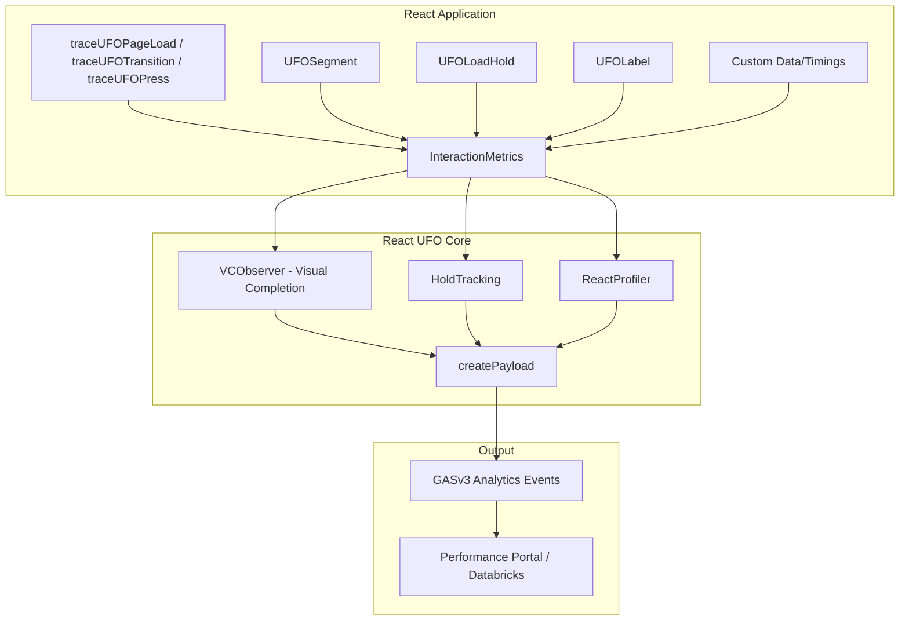
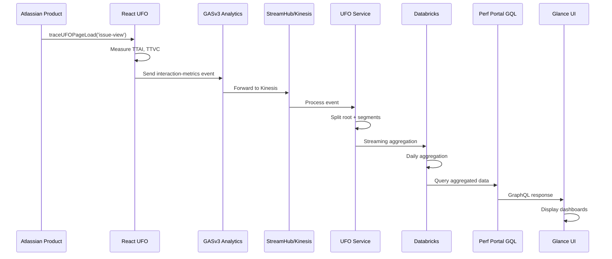

# AGENTS.md - React UFO (@atlaskit/react-ufo)

## Overview

React UFO (User-Facing Observability) is a performance instrumentation library that captures key user experience metrics across Atlassian products. It produces structured performance events that are consumed by downstream analytics systems, primarily the **Glance (Performance Portal)** system.

## Team & Product Context

- **Team**: Frontend Observability (FeObs) — provides end-to-end solutions for frontend observability (performance + reliability)
- **Product**: Glance (formerly Performance Portal) — the one-stop shop for frontend performance data at Atlassian
- **Mission**: Make performance data available, accountable, and actionable
- **Support channel**: `#help-devinfra-fe-observability` (Slack)
- **Jira project**: AFO on `product-fabric.atlassian.net`
- **Shortlinks**: `go/glance`, `go/feo`
- **Package**: `@atlaskit/react-ufo`

## Architecture

### Local Package Architecture



### End-to-End Data Pipeline

React UFO is the **client-side instrumentation** in a larger data pipeline:

```mermaid
graph LR
    subgraph "Client Instrumentation"
        A[React UFO in Products]
    end
    
    subgraph "Transport Layer"
        B[GASv3 analytics-service]
        C[StreamHub / Kinesis]
    end
    
    subgraph "Event Processing - perf-portal-monorepo"
        D[UFO Service - splits events]
        E[BM Data Pipeline]
    end
    
    subgraph "Data Storage"
        F[Socrates - data lake]
        G[Databricks - aggregation]
    end
    
    subgraph "Data Serving"
        H[Perf Portal GQL]
        I[Glance UI]
    end
    
    A --> B --> C --> D --> E --> F --> G --> H --> I
```



**Key Pipeline Details:**
- **UFO Service** splits root interactions from page segments (e.g., `jira.fe.page-load.issue-view` generates multiple `jira.fe.page-segment-load.*` events)
- **Databricks** has streaming (high-resolution) and daily aggregation jobs
- **External dependencies**: Socrates (data lake), Observo (high-cardinality data), SignalFx (metrics/alerting)

## Key Concepts

### Interaction Types
- **`page_load`**: Initial page rendering measurement
- **`transition`**: SPA navigation between routes
- **`press`**: User click/tap interactions
- **`hover`**: Mouse hover interactions
- **`typing`**: Keyboard input performance

### Core Metrics
- **TTI (Time to Interactive)**: Legacy metric from BM3 (Browser Metrics 3)
- **TTAI (Time to All Interactive)**: When all holds are released
- **TTVC (Time to Visual Completion)**: When visual changes stabilize at various thresholds (VC50, VC80, VC90, VC99)
- **FMP (First Meaningful Paint)**: When primary content is visible
- **Speed Index**: Weighted average of visual progress over time

### TTVC Revisions
The package supports multiple TTVC calculation algorithms:
- `fy25.01`, `fy25.02`: Legacy revisions
- `fy25.03`: Current default revision (`DEFAULT_TTVC_REVISION`)
- `fy26.04`, `next`: Experimental revisions

## Directory Structure

```
src/
├── trace-pageload/        # Page load interaction initialization
├── trace-transition/      # SPA transition tracking
├── trace-press/           # Press interaction tracking
├── trace-interaction/     # Generic interaction tracing
├── trace-redirect/        # Route redirect tracking
├── trace-hover/           # Hover interaction tracking
├── interaction-metrics/   # Core interaction state management
├── create-payload/        # Analytics payload generation
├── vc/                    # Visual Completion observer system
│   ├── vc-observer/       # Legacy VC observer (fy25.01, fy25.02)
│   └── vc-observer-new/   # New VC observer (fy25.03+)
├── segment/               # UFOSegment component
├── load-hold/             # UFOLoadHold component
├── label/                 # UFOLabel component
├── config/                # Configuration management
├── custom-data/           # Custom data injection
├── custom-cohort-data/    # Cohort data for A/B testing
├── custom-timings/        # Custom timing tracking
├── custom-spans/          # Custom span tracking
├── feature-flags-accessed/ # Feature flag correlation
├── ssr/                   # SSR timing integration
├── suspense/              # Instrumented React Suspense
├── placeholder/           # Lazy loading placeholder integration
├── report-error/          # Error reporting utilities
├── set-interaction-error/ # Interaction error handling
├── set-terminal-error/    # Terminal error handling
└── common/                # Shared types and utilities
```

## Key Entry Points

### Interaction Initialization
- [`traceUFOPageLoad`](./src/trace-pageload/index.ts) - Start page load measurement
- [`traceUFOTransition`](./src/trace-transition/index.ts) - Start transition measurement
- [`traceUFOPress`](./src/trace-press/index.ts) - Start press interaction measurement
- [`traceUFOInteraction`](./src/trace-interaction/index.ts) - Generic interaction from browser events
- [`traceUFORedirect`](./src/trace-redirect/index.ts) - Track route redirects

### React Components
- [`UFOSegment`](./src/segment/segment.tsx) - Define measurable page sections
- [`UFOLoadHold`](./src/load-hold/UFOLoadHold.tsx) - Hold interaction completion during loading
- [`UFOLabel`](./src/label/UFOLabel.tsx) - Annotate component tree for debugging
- [`Suspense`](./src/suspense/Suspense.tsx) - Instrumented React Suspense boundary
- [`UFOCustomData`](./src/custom-data/index.ts) - Add custom data to interactions
- [`UFOCustomCohortData`](./src/custom-cohort-data/index.ts) - Add cohort data for experiments

### Configuration
- [`setUFOConfig`](./src/config/index.ts) - Configure UFO behavior, sampling rates, and features

### Payload Generation
- [`createPayloads`](./src/create-payload/index.ts) - Generate analytics payloads from interaction data

## Payload Schema

Events are sent with `experience:key` of `custom.interaction-metrics` and follow the schema defined in [`react-ufo-payload-schema.ts`](./src/common/react-ufo-payload-schema.ts).

Key payload fields:
- `experience:name` - The UFO interaction name (e.g., `issue-view`)
- `interactionMetrics.type` - Interaction type (page_load, transition, press, etc.)
- `interactionMetrics.start/end` - Timing boundaries
- `interactionMetrics.segments` - Measured page sections
- `interactionMetrics.holdInfo` - Loading hold timings
- `interactionMetrics.errors` - Captured errors during interaction
- `ufo:vc:rev` - Visual completion revision data
- `ufo:vc:ratios` - VC percentage at various thresholds
- `metric:ttai` - Time to All Interactive
- `metric:fp`, `metric:fcp`, `metric:lcp` - Paint metrics

## Downstream Consumer: Glance (Performance Portal)

The events produced by this package are consumed by the **Glance** system (https://bitbucket.org/atlassian/perf-portal-monorepo):

### perf-portal-monorepo Apps

| App | Purpose | Role in Pipeline |
|-----|---------|------------------|
| `apps/ufo` | UFO event processing service | Event Ingestion & Splitting |
| `apps/bm-data-pipeline` | Browser Metrics data pipeline | Event Processing (BM3) |
| `apps/databricks-jobs` | Data aggregation notebooks | Data Aggregation |
| `apps/perf-portal-gql` | GraphQL API server | Data Serving + Alerts |
| `apps/performance-portal` | React frontend (Glance UI) | Data Visualization |

### Event Flow



### What Glance Provides

1. **Topline Metrics**: FMP, TTVC, TTAI dashboards
2. **Experience Breakdown**: Per-route performance analysis
3. **Segment Analysis**: Component-level timing breakdown
4. **Regression Detection**: Automated performance alerts
5. **P-BREACH Tickets**: Automatic Jira tickets for regressions
6. **AI Investigation**: LLM-powered regression analysis

## Feature Flags

The package uses platform feature flags for gradual rollouts. Key flags are defined in [`package.json`](./package.json):

| Flag | Purpose |
|------|---------|
| `platform_ufo_enable_ttai_with_3p` | Third-party segment timing |
| `platform_ufo_enable_vc_raw_data` | Raw VC data inclusion |
| `platform_ufo_segment_critical_metrics` | Segment-level metrics |
| `platform_ufo_enable_terminal_errors` | Terminal error tracking |
| `platform_ufo_raw_data_thirdparty` | Third-party raw data behavior |
| `platform_ufo_enable_finish_interaction_transition` | Finish interaction on transition |

## Testing

### Unit Tests
```bash
cd platform && afm test unit packages/react-ufo/atlaskit/src/<test-file>
# Or run all:
cd platform && yarn test packages/react-ufo
```

### Integration Tests
```bash
# Terminal 1: Start dev server
cd platform && yarn start:rspack react-ufo

# Terminal 2: Run integration tests
cd platform && yarn test:integration packages/react-ufo/atlaskit/__tests__/ \
  --retries 0 --reporter list --reuse-dev-server \
  --project=desktop-chromium --max-failures=0
```

### Verifying Non-Flaky Tests
To simulate CI-like environment:
```bash
yarn test:integration packages/react-ufo/atlaskit/__tests__/playwright/base.spec.ts \
  --retries 0 --reporter list --reuse-dev-server \
  --project=desktop-chromium --max-failures=0 \
  --repeat-each 50 --workers 50
```

Integration tests are located in `__tests__/playwright/` and use example pages from `examples/`.

## Common Tasks

### Adding a New Interaction Type
1. Create trace function in `src/trace-{type}/`
2. Update `InteractionType` in common types
3. Add configuration support in `src/config/`
4. Update payload generation in `src/create-payload/`

### Modifying VC Calculation
1. VC observers are in `src/vc/vc-observer-new/` (current) and `src/vc/vc-observer/` (legacy)
2. Revisions are controlled by `enabledVCRevisions` config
3. Test changes against existing integration tests

### Adding Custom Metrics
1. Use `addUFOCustomData` for custom attributes
2. Use `addCustomTiming` for custom timing spans
3. Custom data appears in payload under `interactionMetrics.customData`

### Adding Feature Flags
1. Import `fg` from `@atlaskit/platform-feature-flags`
2. Register flag in `package.json` under `platform-feature-flags`
3. Put fg check as **last condition** in if statements: `if (a === b && fg('my_fg'))`

## Important Patterns

### Singleton Pattern
The package uses a singleton pattern for global state:
```typescript
// VCObserver is global per interaction
globalThis.__vcObserver = new VCObserverWrapper(opts);

// Config is module-level singleton
let config: Config | undefined;
```

### Hold System
Holds prevent interaction completion until all loading states resolve:
```typescript
// Hold is added when loading starts
const release = addHold(interactionId, labelStack, 'my-loading');

// Hold is released when loading completes
release();
```

### Segment Tree
Segments are tracked hierarchically for nested measurement:
```typescript
// Parent segment
<UFOSegment name="page">
  // Child segment
  <UFOSegment name="sidebar">
    <Content />
  </UFOSegment>
</UFOSegment>
```

### Third-Party Segments
For external/plugin content:
```typescript
import { UFOThirdPartySegment } from '@atlaskit/react-ufo/segment';

<UFOThirdPartySegment name="external-widget">
  <ExternalWidget />
</UFOThirdPartySegment>
```

## Debugging

### Performance Tracing
Enable Chrome DevTools performance tracing:
```typescript
window.__REACT_UFO_ENABLE_PERF_TRACING = true;
```

### Event Inspection
Listen for interaction completion:
```typescript
window.addEventListener('UFO_FINISH_INTERACTION', (event) => {
  console.log('UFO interaction finished:', event.detail);
});
```

### Chrome Extension
Use the **UFO Chrome Extension** (`apps/ufo-chrome-extension` in perf-portal-monorepo) for DevTools integration.

## Related Packages

| Package | Purpose |
|---------|---------|
| `@atlaskit/react-ufo` | Core UFO instrumentation (this package) |
| `ufo-load-hold` | Standalone load hold component |
| `ufo-apollo-log` | Apollo Client integration |
| `ufo-resource-router-log` | react-resource-router integration |
| `ufo-use-layout-effect-safe` | SSR-safe useLayoutEffect |

## Key Confluence References

| Topic | Link |
|-------|------|
| Team Home (FeObs) | `go/feo` |
| Glance Product Page | `go/glance` |
| Data Architecture Diagram | `go/glance-data-architecture` |
| UFO Pipeline Architecture | [UFO Design - M1 Pipeline Architecture](https://hello.atlassian.net/wiki/spaces/UFO/pages/1050787866) |
| Team Onboarding | [Onboarding](https://hello.atlassian.net/wiki/spaces/APD/pages/1386514416) |
| React UFO Onboarding | [React UFO and UFO Onboarding](https://hello.atlassian.net/wiki/spaces/APD/pages/3615063023) |
| React UFO v2 Design | [react-ufo UFO v2](https://hello.atlassian.net/wiki/spaces/UFO/pages/2305847386) |
| Performance Blog | [react-UFO: A deeper understanding of performance](https://hello.atlassian.net/wiki/spaces/UFO/blog/2022/12/16/2280380649) |

## Configuration Reference

Key configuration options in `setUFOConfig`:

```typescript
interface Config {
  product: string;              // Product identifier (e.g., 'jira', 'confluence')
  region: string;               // Deployment region
  population?: string;          // Event population for segmentation
  rates?: Record<string, number>;  // Sampling rates per experience
  kind?: Record<InteractionKind, number>; // Rates by interaction type
  vc?: {
    enabled?: boolean;
    enabledVCRevisions?: {
      all: TTVCRevision[];
      byExperience?: Record<string, TTVCRevision[]>;
    };
    heatmapSize?: number;
    selectorConfig?: SelectorConfig;
  };
  ssr?: {
    getSSRTimings?: () => SSRTiming[];
    getSSRDoneTime?: () => number | undefined;
  };
  postInteractionLog?: { enabled?: boolean; rates?: Rates; };
  experimentalInteractionMetrics?: { enabled?: boolean; rates?: Rates; };
  terminalErrors?: { enabled?: boolean; };
}
```

## Contributing

When making changes:
1. Run unit tests: `cd platform && yarn test packages/react-ufo`
2. Run integration tests to verify VC measurement accuracy
3. Consider impact on downstream Glance/Performance Portal processing
4. Update sampling rates carefully as they affect data volume
5. Feature flag new functionality for gradual rollout
6. Coordinate with the FeObs team (`#help-devinfra-fe-observability`) for major changes

## Dangerous Operations — Never Do These

1. **Never modify sampling rates without approval** — affects data volume and costs
2. **Never change payload schema without coordination** — breaks downstream processing
3. **Never remove TTVC revisions** — experiences may depend on specific revisions
4. **Never disable holds without understanding impact** — affects TTAI accuracy
5. **Never add blocking operations in hot paths** — affects user performance
