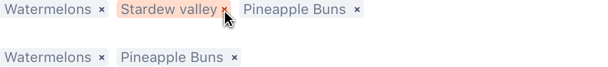

## Usage

Tags are a visual labeling element that can be used for free form text, predefined text, rules or contacts.

There are a number of tag types for different use cases:

- Tags with static text can be used as a flag or as a reference to an object or attribute.
- A tag link can link to more information on the tagged item.
- Removable tags are visible in "edit" mode or in multi-select controls.
- A removable tag link can link to more information.
- Rounded tags with an avatar are used to add or remove people in multi-select controls.
- A rounded tag link with an avatar can link to more information.

Tags are designed to be displayed within a Tag Group. They can be rendered flat, as links, or with a close button.

## Best practices

- Tags can increase the amount of visual noise on a screen, particularly when combined with other visual elements, so use them in moderation.
- Custom color tags can be used to organize a large amount of content. For example, using epic tags for organizing issues in a Jira backlog.

## Behavior
Tags can be permanent or removable (by displaying the remove icon). Depending how the tag is aligned, the flow of the removal will move towards that alignment.

**Align left:**

**Align right:**

## Content guidelines

When writing tags, avoid line-wrapping, and follow the [writing guidelines](/content/writing-style).

## Related
- For status information, use a [lozenge](/components/lozenge).
- For tallies or counts, use a [badge](/components/badge).